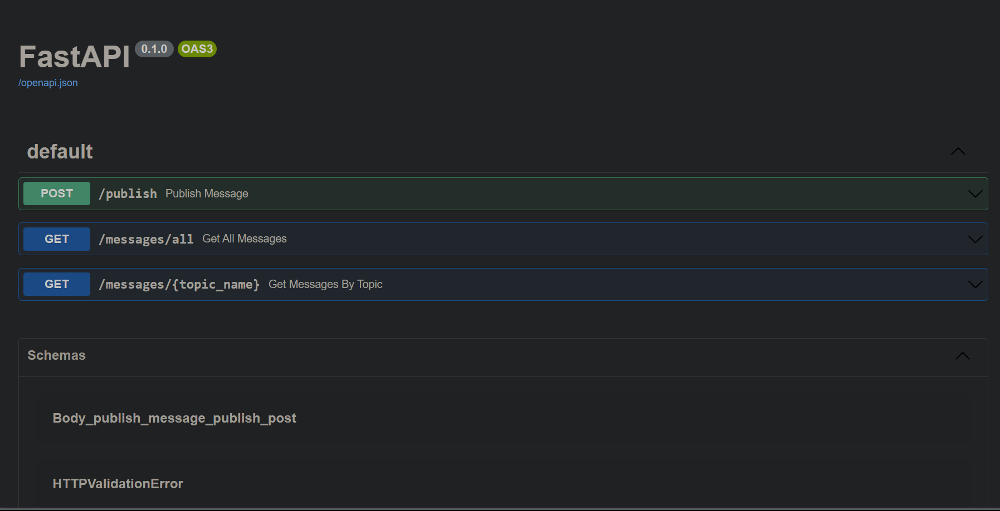

# Integração FastAPI com MQTT

Este projeto demonstra a integração do FastAPI com o broker MQTT Mosquitto. Ele permite que você publique e recupere mensagens MQTT por meio de endpoints HTTP e monitore mensagens MQTT usando o `mosquitto_sub`. A configuração do Docker Compose prepara tanto o aplicativo FastAPI quanto o broker MQTT Mosquitto.


## Pré-requisitos

* Docker e Docker Compose instalados no seu sistema.
* Conhecimento básico de uso do Docker e Docker Compose.

## Começando

1. Clone este repositório em sua máquina local:

    ```bash
    git clone https://github.com/Brilhante29/fastapi_with_mqtt.git
    cd fastapi_with_mqtt
    ```

2. Inicie os contêineres Docker usando o Docker Compose:

    ```bash
    cd docker && docker-compose up --build -d
    ```

   Este comando iniciará dois serviços: `mosquitto` (o broker MQTT) e `fastapi_app` (o aplicativo FastAPI).

3. Acesse a documentação da API Swagger:

   Abra o seu navegador da web e acesse [http://localhost:8000/docs](http://localhost:8000/docs). Você pode usar essa documentação interativa da API para testar os endpoints.

   

## Publicando Mensagens MQTT

Para publicar mensagens MQTT em um tópico específico, você pode usar a seguinte solicitação HTTP:

### Publicar Mensagem

Envie uma solicitação POST para: [http://localhost:8000/publish](http://localhost:8000/publish)

```json
{
  "topic_data": {
    "topic": "seu_nome_de_tópico"
  },
  "message": {
    "topic": "subtópico",
    "payload": "conteúdo_da_sua_mensagem"
  }
}
```

Substitua `seu_nome_de_tópico` pelo tópico MQTT no qual você deseja publicar e `conteúdo_da_sua_mensagem` pelo conteúdo da mensagem.

## Recuperando Mensagens MQTT

Você pode recuperar mensagens MQTT usando os seguintes endpoints HTTP:

### Pegar Todas as Mensagens

Envie uma solicitação GET para: `http://localhost:8000/messages/all`

Este endpoint retornará todas as mensagens MQTT acumuladas.

### Pegar Mensagens por Tópico

Envie uma solicitação GET para: `http://localhost:8000/messages/seu_nome_de_tópico`

Substitua `seu_nome_de_tópico` pelo tópico MQTT para o qual você deseja recuperar mensagens.

## Monitorando Mensagens MQTT

Para monitorar mensagens MQTT chegando no broker MQTT, você pode usar o comando `mosquitto_sub` de dentro do contêiner `mosquitto`:

1. Acesse o terminal do contêiner Mosquitto:

    ```bash
    docker exec -it fastapi-mqtt-integration_mosquitto_1 /bin/sh
    ```

2. Inscreva-se em um tópico MQTT:

    ```bash
    mosquitto_sub -h localhost -t seu_nome_de_tópico
    ```

    Substitua `seu_nome_de_tópico` pelo tópico MQTT que você deseja monitorar.

    Agora você verá mensagens MQTT chegando para o tópico especificado no terminal do contêiner.

    Para sair do contêiner, digite `exit`.

## Parando os Contêineres

Para parar e remover os contêineres Docker, execute o seguinte comando:

```bash
docker-compose down
